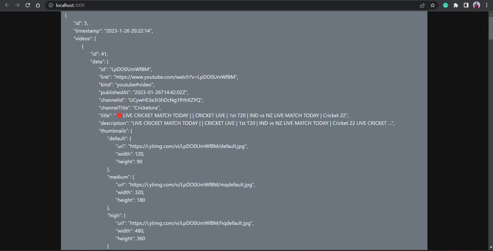

# Youtube Fetch System

> This repository contains the code for a backend to fetch latest videos on a given topic and store the results in a sqlite database.

## Built With

- Node.js
- Express.js
- EJS view engine
- Sqlite3
- YouTube Search API

## Getting Started

These instructions will get you a copy of the project up and running on your local machine for development and testing purposes.

### Prerequisites

- Node.js and npm
- Docker

### Running Instructions

```bash
$ git clone https://www.github.com/singhankit333/yt-async-fetch.git
$ cd ./yt-async-fetch
$ npm ci
$ PORT=3000 TOPIC=<your search topic> TOKEN=<YouTube API Key> npm start
```

### Dockerization Build & Run Instructions

```bash
$ git clone https://www.github.com/singhankit333/yt-async-fetch.git
$ cd ./yt-async-fetch
$ docker build -t yt-async-fetch .
$ docker run -p 3000:3000 -e PORT=3000 -e TOPIC=<Search Topic> -e TOKEN=<YouTube API Key> yt-async-fetch
```

> You can then go http://localhost:3000/?page_id=<page_number> to see the results of the search. Where 0 being the mose recent results and higher page number the older.

## Screenshot



## Author

- **Ankit Kumar Singh** - [singhankit333](https://github.com/singhankit333)
